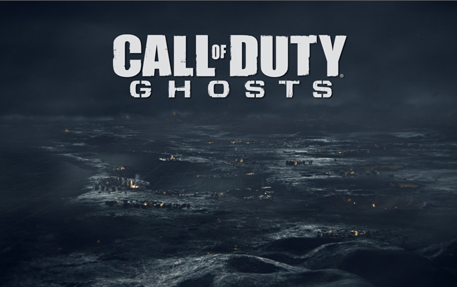

# IW6 MP PATCH

Basically, Call of Duty: Ghosts has this annoying tendency to crash on launch (or whilst loading maps) for quite a few players on Steam, myself included. So I’ve fixed it all 

> **HEADS UP:**  
> If your game already launches fine and doesn't insta crash or kick you on map loads, you don't need this patch at all. Enjoy your game!  
> If it's constantly crashing, keep reading.

---

## How to Install / Inject

Since this is a .dll patch, you gotta inject it into the game's process.

1. [Download](https://github.com/sj1607/iw6-patch/releases/latest)
2. Launch Ghosts on Steam.
3. **TIMING IS KEY:** Wait for the splash screen image to pop up on your screen.  
   *(Inject it right as this image appears, otherwise the game will just die like usual).*

   

4. Open Process Hacker (or whatever DLL injector you like).
5. Find iw6mp64_ship.exe, right-click it, go to Miscellaneous -> Inject DLL.
6. Select this compiled .dll file, and you're good to go!

---

## FAQ / What does this actually fix?

<b>Q: Why was my game crashing on launch in the first place ?</b>

 
The game tries to send logs to Demonware via a function called <code>bd_logger</code>. For whatever reason, it fails miserably and just instantly kills the game.

<b>Q: Why was my game crashing when loading into a map ?</b>

 
I noticed this happening on my setup: Ghosts tries to read structured data (like stats tables) during map loading. If a table is empty, the game doesn't check if the data exists it just tries to read garbage memory and yeets itself to desktop. If you have the same launch crash issue, chances are you'll run into this one too. This patch adds a sanity check so it bails safely instead of crashing.

<b>Q: What about that annoying "Invalid structure definition / stats group" error ?</b>

 
Same deal as above when stats tables are empty, the game panics and throws a pop-up error that kicks you during <code>OnPlayerConnect</code>. The game actually runs totally fine despite this, so the patch just filters out that specific error message so you don't get booted out of the match.

